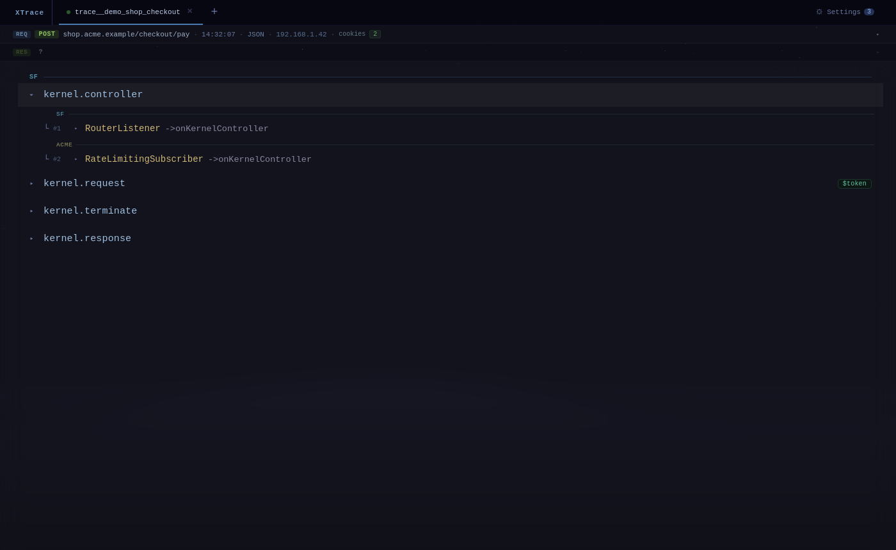
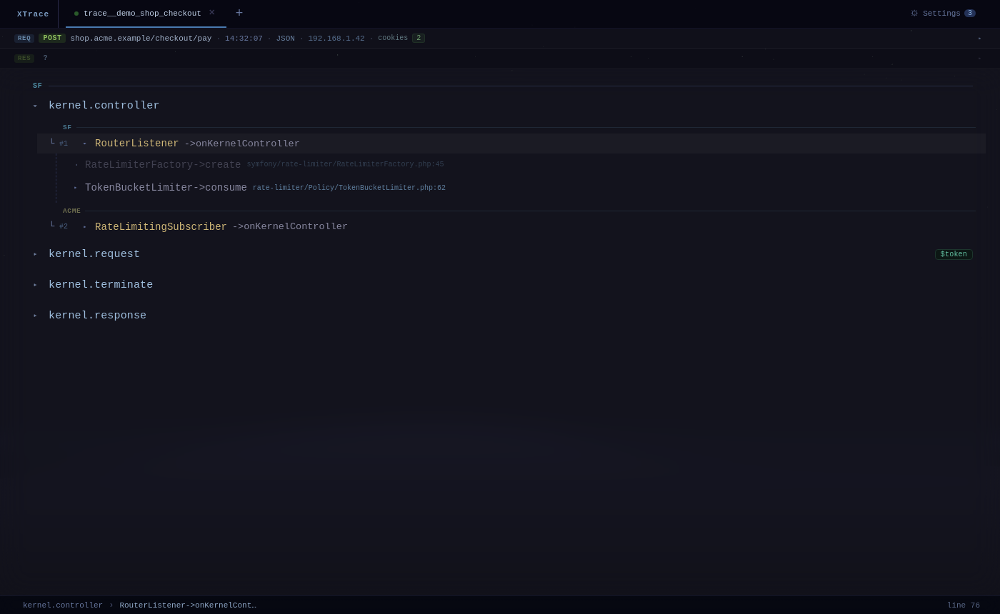
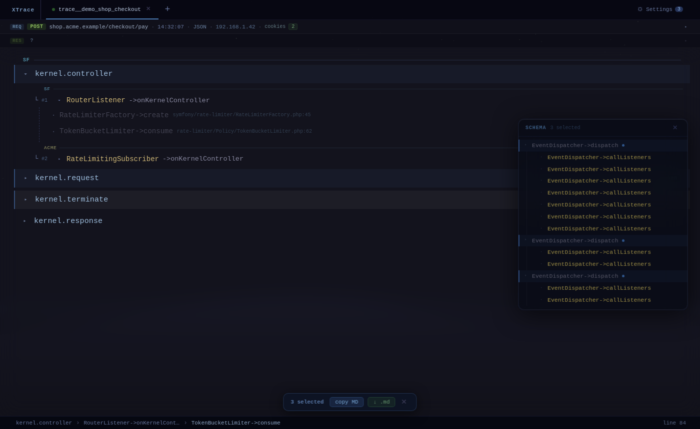
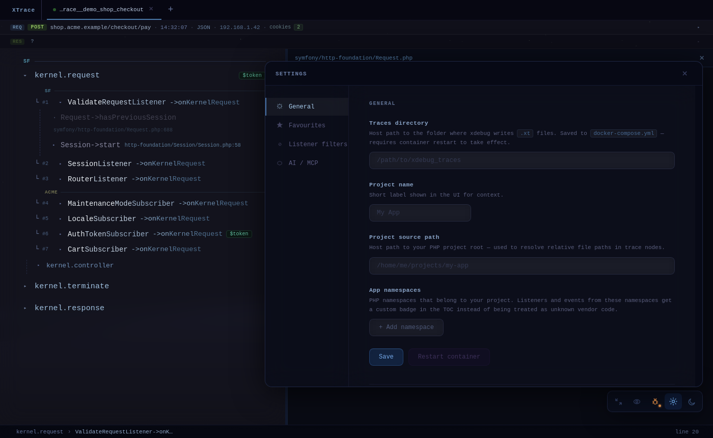
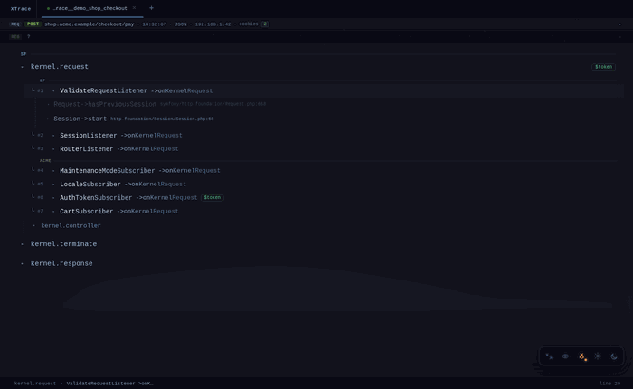

# XTrace Explorer

A browser-based viewer for [Xdebug](https://xdebug.org/) function trace files (`.xt`). Parses multi-million-line traces asynchronously and presents them as an interactive event-driven call tree — making it practical to navigate Symfony request lifecycles without scrolling raw text.


---

## Features

- **Event TOC** — shows Symfony events (`kernel.request`, `kernel.controller`, …) and their listeners at a glance
- **Lazy call tree** — expand any listener to drill into its call stack on demand; noise-filtered by default
- **Deep dive** — click into any call node to recurse as deep as needed
- **Schema panel** — select multiple nodes and copy a structured Markdown schema to clipboard
- **Annotations** — attach notes to trace lines; export the whole trace as Markdown
- **Search** — find any method signature across millions of lines instantly
- **Multi-tab** — open several trace files side by side
- **Settings** — configure traces directory, project namespaces, listener filters, Xdebug integration, and AI/MCP connection from the UI

---

## Screenshots

| Empty state | TOC — events & listeners |
|---|---|
|  |  |

| Expanded listener with call tree | Deep dive |
|---|---|
|  |  |

| Schema export panel | Settings |
|---|---|
|  |  |

**Animated demos:**




---

## Quick start

### Prerequisites

- Docker + Docker Compose
- Xdebug trace files (`.xt`) generated by your PHP app

### 1. Configure Xdebug

In your app's `php.ini`:

```ini
xdebug.mode = trace
xdebug.output_dir = /path/to/xdebug_traces
xdebug.trace_output_name = trace.%t.%p
```

### 2. Start XTrace Explorer

```bash
git clone https://github.com/youruser/xtrace-explorer.git
cd xtrace-explorer

# Set the path to your traces directory
export TRACES_DIR=/path/to/xdebug_traces

docker compose up -d app
```

Open **http://localhost:8765**, click **+**, and select a trace file.

### 3. (Optional) MCP server for AI assistants

```bash
docker compose up -d mcp
```

Connect Claude Code:

```bash
claude mcp add xtrace --transport sse http://localhost:8766/sse
```

---

## Development

```bash
# Backend (Symfony 7 + PHP)
docker compose build app && docker compose up -d app

# Frontend (Vue 3 + Vite) — output goes to symfony/public/app/
cd frontend && npm run build

# Run backend tests
docker compose exec xtrace-explorer-app-1 php vendor/bin/phpunit
```

Backend lives in `symfony/`, frontend in `frontend/`. The async trace parser runs as a Symfony Messenger worker inside the container (see `docker/supervisord.conf`).

---

## How it works

1. You open a `.xt` file → the backend enqueues a parse job via Symfony Messenger
2. `TraceParser` builds a sparse byte-offset index (`line_index.json`) and a Table of Contents (`toc.json`) that identifies every `TraceableEventDispatcher->dispatch` call and its listeners
3. The frontend fetches the TOC and renders events lazily; clicking a node calls `/api/children` which seeks directly to the right position in the file using the index
4. Noise filtering removes Symfony internals (Container, Stopwatch, Reflection, …) by default; toggle "show all calls" to see everything

Trace files with 3 million+ lines parse in seconds and navigate without loading the full file into memory.

---

## License

MIT
