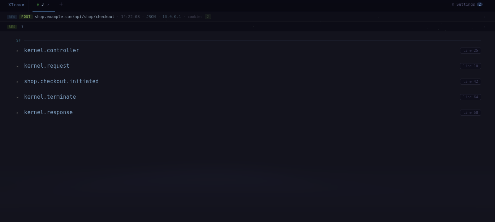
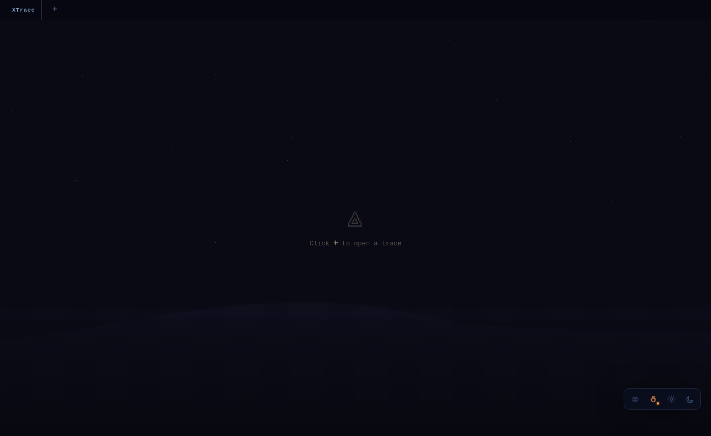
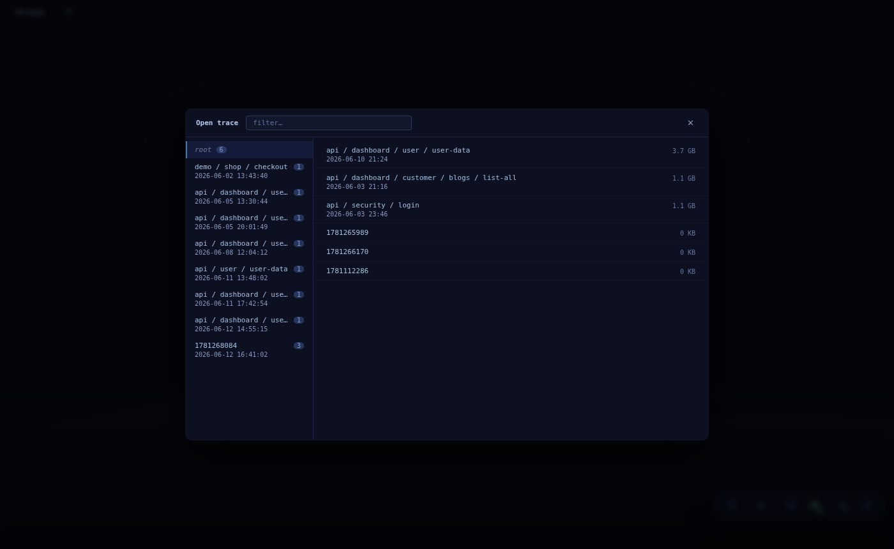
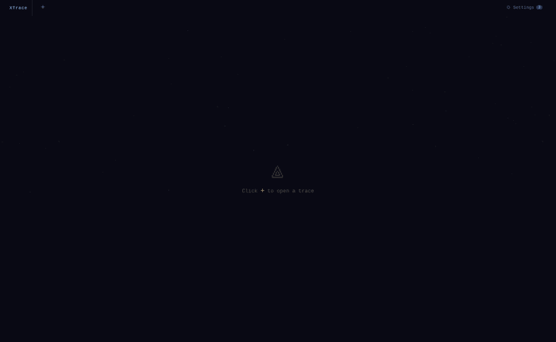

# XTrace Explorer

A browser-based viewer for [Xdebug](https://xdebug.org/) function trace files (`.xt`). Parses multi-million-line traces asynchronously and presents them as an interactive event-driven call tree — making it practical to navigate Symfony request lifecycles without scrolling raw text.



---

## Features

- **Event TOC** — shows Symfony events (`kernel.request`, `kernel.controller`, …) and their listeners at a glance; listeners grouped by source namespace (SF / ACME / …)
- **Lazy call tree** — click any listener to expand its full call stack on demand; noise-filtered by default, "show all" toggle to see everything
- **Frosted-glass code view** *(v0.11.0)* — click any call node to open the PHP source in a translucent panel on the right edge; the TOC stays fully visible (and scrollable) behind the `backdrop-filter: blur(28px)` panel. Drag the left edge to resize, `Esc` to close.
- **SQL chronology** — `by caller` / `tree` / `list` views, with N+1 detection, query-builder chain extraction for each trigger, and `⚡ eager` badges on detected N+1 patterns
- **AI summary of a trace** *(v0.11.0)* — one-click ✨ button in the Ctrl menu generates a markdown summary (request context, TOC, SQL chronology with N+1 detection and QueryBuilder chains, annotations, timings) and copies it to the clipboard via a preview modal. Also exposed as the MCP `summarize` tool for AI agents.
- **Runtime value annotations** — source lines are annotated with actual runtime values from the trace: argument values, return values, object fields — even without `collect_return`
- **Deep drill-down** — expand any call node to recurse as deep as needed, one level at a time
- **Nested events** — authorization votes and sub-dispatches shown inline, repeated vote groups collapsed to `× N`
- **Xdebug mode control** — switch between `off` / `debug` / `debug+trace` directly from the UI without touching `php.ini` by hand; "organize" button moves session trace files into a dated folder
- **Dark and light theme** — toggle with one click from the float bar
- **Schema panel** — select multiple nodes (Ctrl+click) and copy a structured Markdown call schema to clipboard
- **Annotations** — attach notes to trace lines; export the whole annotated trace as Markdown
- **Search** — find any method signature across millions of lines instantly
- **Multi-tab** — open several trace files side by side
- **Favourites** — track specific method patterns with custom labels; matched listeners are highlighted in the TOC
- **Listener filters** — hide noisy listeners (e.g. Stopwatch, Monolog) from the TOC permanently
- **Settings** — configure traces directory, project source path, app namespaces, listener filters, and MCP connection from the UI

---

## Screenshots

| Empty state | File picker |
|---|---|
|  |  |

| TOC — events & listeners | SQL chronology with N+1 detection |
|---|---|
|  |  |

| AI summary modal (✨) | Frosted-glass code view |
|---|---|
|  |  |

| Ctrl menu — 4 grouped blocks with ✨ AI summary |
|---|
|  |

**Opening a trace and drilling down:**



---

## Quick start

### Prerequisites

- Docker + Docker Compose
- Xdebug trace files (`.xt`) generated by your PHP app

### 1. Configure Xdebug

In your app's `php.ini`:

```ini
xdebug.mode = trace
xdebug.output_dir = /path/to/xdebug_traces
xdebug.trace_output_name = trace.%t.%p
```

### 2. Start XTrace Explorer

```bash
git clone https://github.com/youruser/xtrace-explorer.git
cd xtrace-explorer

docker compose up -d app
```

Open **http://localhost:8765**, click **Settings** (gear icon, bottom-right), set **Traces directory** to the path where your `.xt` files land, then click **Save** → **Restart container**.

After the container restarts, click **+** to open a trace file.

### 3. (Optional) MCP server for AI assistants

```bash
docker compose up -d mcp
```

Connect Claude Code:

```bash
claude mcp add xtrace --transport sse http://localhost:8766/sse
```

Then call `summarize(file_id=34)` to get a one-shot AI-ready summary of any parsed trace.

---

## Development

```bash
# Backend (Symfony 7 + PHP)
docker compose build app && docker compose up -d app

# Frontend (Vue 3 + Vite) — output goes to symfony/public/app/
cd frontend && npm run build

# Run backend tests
docker compose exec app php vendor/bin/phpunit
```

Backend lives in `symfony/`, frontend in `frontend/`. The async trace parser runs as a Symfony Messenger worker inside the container (see `docker/supervisord.conf`).

---

## How it works

1. You open a `.xt` file → the backend enqueues a parse job via Symfony Messenger
2. `TraceParser` builds a sparse byte-offset index (`line_index.json`) and a Table of Contents (`toc.json`) that identifies every `TraceableEventDispatcher->dispatch` call, its listeners, and the `App\` method calls each block triggers
3. The frontend fetches the TOC and renders events lazily; clicking a listener calls `/api/children` which seeks directly to the right byte position in the file using the index — no full file load
4. Clicking a call node with a known source file opens the PHP source in a frosted-glass panel on the right; syntax-highlighted, scrolled to the target line, with child call sites annotated inline
5. `/api/var-context` parses raw object arguments from the trace to produce actual runtime values (field values, return values, inferred types) shown as inline annotations on source lines
6. Noise filtering removes Symfony internals (Container, Stopwatch, Reflection, …) by default; toggle "show all calls" per listener to see everything
7. The floating control bar (reorganised in v0.11.0 into four semantic groups) lets you switch Xdebug modes, manage starred trace patterns, and copy a one-click AI summary of the active trace
8. The AI summary endpoint (`/api/summary/{id}`) renders a single markdown document that the MCP `summarize` tool (and the UI's ✨ button) deliver to the LLM

Trace files with 3 million+ lines parse in seconds and navigate without loading the full file into memory.

---

## License

MIT
