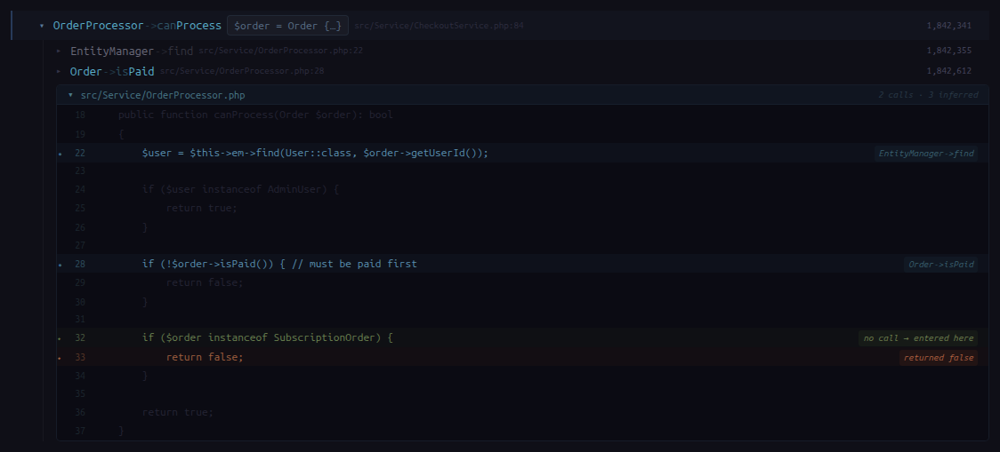

# XTrace Explorer

> A browser-based viewer for Xdebug function trace files (`.xt`). Navigate millions of function calls, drill into event listeners, search by class name, and annotate interesting lines — all without loading the full trace into memory.


---

## What problem does it solve

Xdebug can record every function call in a PHP request to a `.xt` file. A single request can produce **3–10 million lines** and hundreds of megabytes. Opening that in a text editor is painful.

XTrace Explorer parses the file in the background, builds a line index for fast random access, extracts the Symfony event dispatch tree, and lets you navigate it lazily in the browser — expanding only what you need.

---

## Screenshots

**Empty state — click `+` to open a trace:**


**File browser — lists all `.xt` files from your configured trace directory:**


**TOC view — all dispatched Symfony events for the request, grouped by source (SF / APP / JWT / 2FA...):**


**Expand an event — see its listeners grouped by source:**


**Drill into a listener — lazy-loaded call tree with arguments, return values, and file:line:**


**Inline source view — shows the PHP function body with called lines highlighted and unrecorded branches (instanceof, etc.) inferred from position:**



**`Ctrl+Click` events or listeners to select them, then export as Markdown — copy to clipboard or download as `.md`:**


---

## Features

- **Multi-tab** — open several traces side by side, sessions persist across page reloads
- **Event TOC** — shows every `TraceableEventDispatcher->dispatch` call, grouped by source framework (SF / APP / JWT / 2FA / etc.)
- **Lazy call tree** — children are fetched on demand; only the nodes you expand are loaded
- **Arguments & return values** — parsed from xdebug format: objects simplified to `ClassName {…}`, strings truncated, JWTs replaced with `<JWT>`
- **Inline source view** — when you expand a call, shows the PHP function body with called lines highlighted; lines with `instanceof`, `return`, etc. that produced no calls are inferred and annotated automatically — so you can see which branch was taken even without `collect_return`
- **Noise filter** — hides Symfony/Doctrine plumbing (Container, ServiceLocator, Stopwatch, etc.) by default; toggle with "show all calls"
- **Full-text search** — search by class/method name across the entire trace
- **Ctrl+Click export** — select any events/listeners with `Ctrl+Click`, then copy as Markdown or download `.md` — useful for sharing findings or writing postmortems
- **Favourites** — bookmark traces for quick access
- **Request info bar** — shows method, URI, host, IP, content-type, cookies count at a glance
- **Session persistence** — open tabs and scroll positions are restored on reload

---

## Requirements

- Docker + Docker Compose
- An Xdebug trace directory (files generated with `xdebug.mode=trace`)

---

## Quick start

```bash
git clone https://github.com/Icetlin/XTrace-Explorer.git
cd XTrace-Explorer
cp .env.example .env
```

Edit `.env` — set the three paths for your machine:

```env
# Where xdebug writes .xt files on your host
TRACES_DIR=/path/to/xdebug_traces

# PHPStorm Xdebug server path mapping (Settings → PHP → Servers):
SOURCE_HOST_DIR=/home/me/projects/my-app       # local  (left column)
SOURCE_CONTAINER_DIR=/var/www/my-app           # remote (right column)
```

```bash
docker compose up -d
```

Open **http://localhost:8765**, click **`+`**, pick a `.xt` file.

First open triggers background parsing (10–60 s for large files). Status is shown in the tab. Parsed index is cached — subsequent opens are instant.

You can also change paths later via **Settings → General** (gear icon, top-right):

| Setting | What it is |
|---------|-----------|
| **Traces directory** | Host path to your xdebug trace folder — saved to `docker-compose.yml` and applied on container restart |
| **Project source path** | Host path to your PHP project root — used for inline source view |
| **App namespaces** | PHP namespaces that belong to your project (e.g. `App\`) — get colored badges in the call tree |

After saving the trace directory: click **Restart container** so Docker remounts the volume. Then click **`+`** and pick a `.xt` file.

First open triggers background parsing (10–60 s for large files). Status is shown in the tab. Parsed index is cached — subsequent opens are instant.

---

## Generating traces with Xdebug

### Option A — via Settings UI (recommended if using Docker)

Open **Settings → Xdebug** (⚡ in the sidebar). Configure the container name and compose project directory, then click a mode card:

| Mode | What happens |
|------|-------------|
| **Off** | Xdebug disabled entirely |
| **Debug only** | Breakpoints active; trace on `XDEBUG_TRIGGER` only |
| **Debug + Trace** | Every request writes a `.xt` file to the trace dir |

XTrace Explorer writes the xdebug ini directly into the container and restarts it — no manual ssh or config editing needed.

### Option B — manual xdebug.ini

Add to your `php.ini` / `xdebug.ini`:

**Trace every request:**
```ini
zend_extension=xdebug
xdebug.mode=debug,trace
xdebug.start_with_request=yes
xdebug.output_dir=/path/to/traces
xdebug.trace_output_name=trace_%R_%t
```

**Trace on demand (via trigger):**
```ini
zend_extension=xdebug
xdebug.mode=debug,trace
xdebug.start_with_request=trigger
xdebug.output_dir=/path/to/traces
xdebug.trace_output_name=trace_%R_%t
```

Trigger a trace request:

```bash
# trigger via cookie
curl -b "XDEBUG_TRIGGER=1" https://your-app.local/api/some/endpoint

# or via query param
curl "https://your-app.local/api/some/endpoint?XDEBUG_TRIGGER=1"
```

The resulting `.xt` file will appear in the file browser automatically.

---

## Architecture

```
xtrace-explorer/
├── Dockerfile                  # PHP 8.3-fpm + nginx + supervisord, all in one image
├── docker-compose.yml
├── symfony/                    # Symfony 7 backend
│   └── src/
│       ├── Controller/TraceController.php   # REST API
│       ├── Service/TraceParser.php          # Parses .xt → toc.json + line_index.json
│       ├── Service/TraceIndex.php           # getChildren, search (random-access via index)
│       ├── Entity/TraceFile.php
│       ├── Entity/Annotation.php
│       └── MessageHandler/ParseTraceHandler.php  # Symfony Messenger async worker
└── frontend/                   # Vue 3 + Vite + Pinia
    └── src/
        ├── App.vue
        ├── stores/trace.js
        └── components/
            ├── TocTree.vue     # Event → Listener tree
            └── CallNode.vue    # Recursive call node (lazy)
```

**How parsing works:**

1. On first open, a `ParseTraceMessage` is dispatched to a Symfony Messenger worker
2. `TraceParser` scans the file once, building:
   - `line_index.json` — byte offset every 500 lines (enables `fseek` to any line in O(1))
   - `toc.json` — the event dispatch tree (event name → listeners), extracted by tracking `TraceableEventDispatcher->dispatch` calls on a stack (handles nested events correctly)
   - `meta.json` — total line count + request/response info
3. `TraceIndex::getChildren` uses the line index to seek directly to any call and read its immediate children, applying a noise filter

**API endpoints:**

| Method | URL | Description |
|--------|-----|-------------|
| `GET` | `/api/browse` | list `.xt` files from traces dir |
| `POST` | `/api/open` | open a file, start parsing |
| `GET` | `/api/status/{id}` | parsing status + progress |
| `GET` | `/api/toc/{id}` | event dispatch tree |
| `GET` | `/api/children/{id}?line_no=N&depth=D&raw=0` | children of a call node |
| `GET` | `/api/search/{id}?q=...` | search by class/method name |
| `GET/POST/DELETE` | `/api/annotations/{id}` | per-line annotations |
| `GET` | `/api/annotations/{id}/export` | export annotations as Markdown |
| `POST` | `/api/reparse/{id}` | force re-parse (after upgrading) |
| `GET/POST` | `/api/settings` | read / write all settings (General + Xdebug) |
| `GET` | `/api/xdebug/status` | current xdebug mode from the PHP container |
| `POST` | `/api/xdebug/set` | set xdebug mode (`off` / `debug` / `debug+trace`) |
| `POST` | `/api/xdebug/clear` | delete all `trace_*.xt` from the container trace dir |

---

## Development

```bash
# Backend (runs on :8765)
docker compose up -d

# Frontend dev server with HMR
cd frontend
npm install
npm run dev   # proxies API to localhost:8765

# After changing TraceParser — re-parse a file
curl -X POST http://localhost:8765/api/reparse/<file_id>

# After changing frontend — rebuild
cd frontend && npm run build
```

---

## License

MIT — see [LICENSE](LICENSE).
